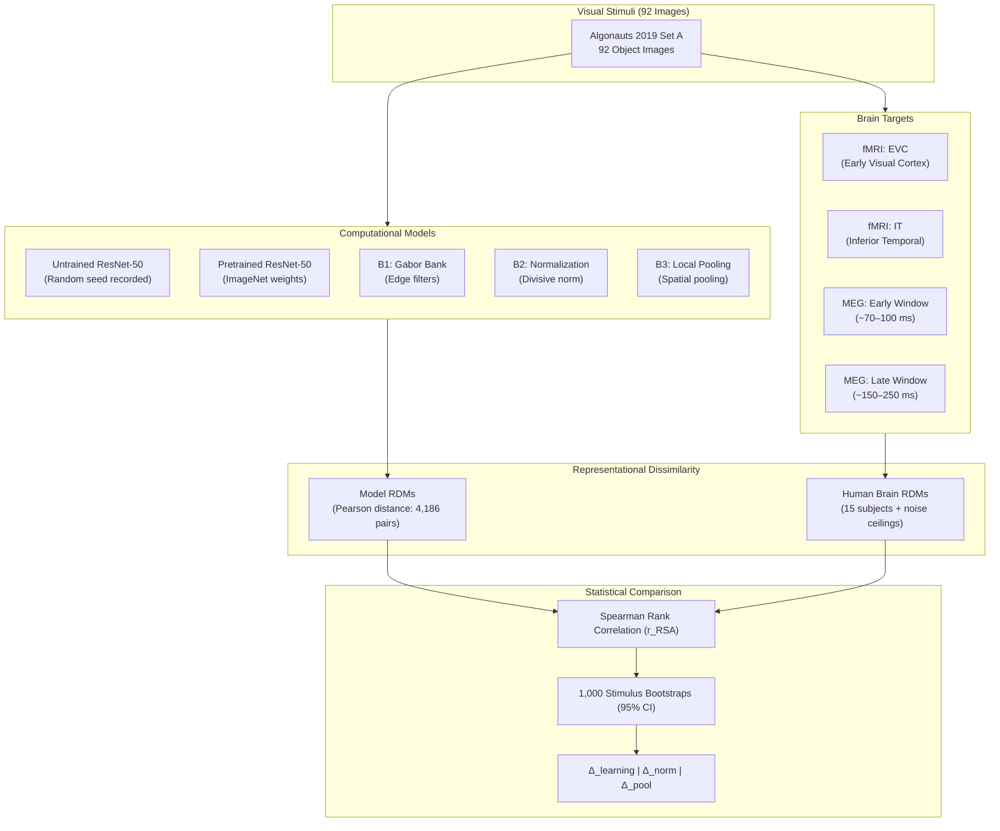

<div align="center">

# 🧠 Visual Representations in Brains and Computational Models

<p align="center">
  <strong>Investigating biological visual processing and artificial neural representations using Representational Similarity Analysis (RSA).</strong>
</p>

<p align="center">
  <strong>Project #24 — Introduction to Neural and Cognitive Modelling (INCM)</strong><br />
  <strong>IIIT Hyderabad</strong> $\cdot$ <strong>Instructor: Dr. S. Bapiraju</strong> $\cdot$ <strong>Author: Nisarg Suthar</strong>
</p>

[](https://www.python.org/)
[](https://github.com/astral-sh/uv)
[](https://pytorch.org/)
[](https://pytorch.org/vision/)
[](https://en.wikipedia.org/wiki/Computational_neuroscience)
[](http://algonauts.csail.mit.edu/2019/)

<br />



</div>

---

## 📌 Project Overview

This project investigates whether visual models represent image similarities in ways that correspond to human neural activity across spatial brain regions (fMRI) and temporal processing windows (MEG).

Following **Project #24**, we benchmark two classes of computational models against the **Algonauts 2019 Challenge Training Set A** (92 images):

1. **Deep Residual Networks:** Comparing an untrained (random weights) vs. ImageNet-pretrained **ResNet-50** across early, intermediate, and deep stages (`layer1`, `layer3`, `layer4`).
2. **Bio-inspired Canonical Computations:** A feedforward Gabor filter hierarchy incorporating orientation selectivity, divisive normalization, and spatial pooling.

---

## 🔬 Research Questions & Hypotheses

- **RQ1 — Learning:** _Does a trained ResNet-50 match brain responses better than an untrained ResNet-50?_
  - **H1:** The pretrained model will achieve higher RSA alignment than the random network, particularly in intermediate/late layers (`layer3`, `layer4`) and for higher-level visual targets.
- **RQ2 — Biological Computations:** _How does adding divisive normalization and subsequent local pooling alter the Gabor model's similarity to brain responses?_
  - **H2:** Adding canonical computations will improve early/intermediate representational alignment (especially with EVC and early MEG), without necessarily improving every downstream target.
- **RQ3 — Early and Late Processing:** _Do different model stages show distinct patterns of similarity to EVC vs. IT in space, and to early vs. late MEG responses in time?_
  - **H3:** Early stages (Gabor bank B1–B3, ResNet `layer1`) will exhibit a stronger preference for EVC and early MEG responses, whereas deeper trained layers (`layer3`, `layer4`) will shift representational alignment toward IT and late MEG responses.

---

## 🏗️ Models & Architectural Pipeline

| Model Stage              | Architecture / Operation                                                                                    | Input / Processing Specs                              |
| :----------------------- | :---------------------------------------------------------------------------------------------------------- | :---------------------------------------------------- |
| **Random ResNet-50**     | Untrained ResNet-50 with fixed, recorded random seed                                                        | RGB, $224 \times 224$, ImageNet normalization         |
| **Pretrained ResNet-50** | PyTorch ImageNet-1k supervised weights                                                                      | RGB, $224 \times 224$, ImageNet normalization         |
| **B1: Gabor Bank**       | Edge/orientation-selective spatial filters                                                                  | Grayscale $[0, 1]$, $224 \times 224$, no augmentation |
| **B2: Normalization**    | B1 divided by activity of neighboring filters ([Carandini & Heeger, 2012](https://doi.org/10.1038/nrn3136)) | Divisive canonical normalization                      |
| **B3: Local Pooling**    | B2 followed by local spatial pooling ([Riesenhuber & Poggio, 1999](https://doi.org/10.1038/14819))          | Multi-scale spatial tolerance                         |

### Feature Preservation Strategy

To preserve spatial structure while keeping feature dimensions manageable:

- Larger intermediate feature maps are downsampled via spatial pooling to $8 \times 8$.
- Smaller native feature maps (such as ResNet `layer4`'s native $7 \times 7$ grid) are preserved before flattening into feature vectors $z_i$.

---

## 🧠 Brain Dataset (Algonauts 2019 Training Set A)

We utilize the preprocessed human neuroimaging benchmark data from **The Algonauts Project 2019** (Cichy et al., 2019; Mohsenzadeh et al., 2019), consisting of **92 object images** and corresponding precomputed Representational Dissimilarity Matrices (RDMs):

- **Track 1 — fMRI Spatial Targets:**
  - **EVC (Early Visual Cortex):** V1, V2, V3 responding to low-level visual features.
  - **IT (Inferior Temporal Cortex):** Higher-level ventral cortex encoding category and object geometry.
- **Track 2 — MEG Temporal Targets:**
  - **Early MEG Interval:** $\sim 70\text{--}100\text{ ms}$ post-stimulus onset (EVC-dominant dynamic processing).
  - **Late MEG Interval:** $\sim 150\text{--}250\text{ ms}$ post-stimulus onset (IT-dominant categorical emergence).
- **Participant Reliability:** Includes individual RDMs across 15 participants along with lower and upper noise ceilings.

---

## 📐 Evaluation & Statistical Methodology

### 1. Representational Dissimilarity Matrices (RDMs)

For each model stage, pairwise distance between stimulus feature vectors $z_i, z_j$ is computed via Pearson correlation distance:
$$D_{ij} = 1 - \rho_{\text{Pearson}}(z_i, z_j)$$

Across 92 images, each symmetric RDM yields $\frac{92 \times 91}{2} = 4{,}186$ unique off-diagonal pairwise dissimilarities ($\text{vec}_u$).

### 2. Second-Order Brain Alignment (RSA)

Alignment between the model RDM and each brain target RDM is quantified via Spearman's rank correlation:

$$r_{\text{RSA}} = \rho_{\text{Spearman}}(\text{vec}_u D_{\text{model}}, \text{vec}_u D_{\text{brain}})$$

### 3. Hypothesis Difference Metrics

To isolate specific computational contributions:
$$\Delta_{\text{learning}} = r_{\text{pretrained}} - r_{\text{random}} \quad (\text{within same ResNet layer})$$
$$\Delta_{\text{norm}} = r_{\text{B2}} - r_{\text{B1}}, \qquad \Delta_{\text{pool}} = r_{\text{B3}} - r_{\text{B2}}$$

### 4. Non-Parametric Bootstrap Statistics

- **Stimulus Bootstrap:** $\ge 1{,}000$ bootstrap iterations resampling stimulus images with replacement (excluding identity pairs) to construct 95% confidence intervals.
- **Noise Ceiling Normalization:** Reporting raw $r_{\text{RSA}}$ alongside percentage of explainable variance relative to subject noise ceilings.

---

## 📂 Repository Structure

```text
Project/
├── Data/                                  # Benchmark neural datasets & stimuli
│   ├── algonautsChallenge2019.zip         # Downloaded archive (104.5 MB)
│   └── algonautsChallenge2019/            # Extracted challenge data
│       ├── Training_Data/92_Image_Set/    # 92 images, target_fmri.mat, target_meg.mat
│       ├── Evaluation_Scripts/            # Official benchmark scoring routines
│       └── Feature_Extract/               # Baseline reference extractors
├── Reports/
│   └── Proposal/                          # LaTeX sources & proposal PDF (Project #24)
│       └── main.tex
└── Code/
    ├── download_data.py                   # Automated, safe dataset downloader & verifier
    ├── main.py                            # Pipeline execution entrypoint
    ├── pyproject.toml                     # uv project configuration & dependencies
    ├── uv.lock                            # Deterministic dependency lockfile
    ├── README.md                          # Project documentation
    └── src/
        ├── models/                        # Gabor bank (B1-B3) & ResNet-50 feature hooks
        ├── analysis/                      # RDM generation, RSA & bootstrap routines
        └── data/                          # Stimulus loaders & Algonauts .mat parsers
```

---

## 🚀 Getting Started

This project is managed with [`uv`](https://github.com/astral-sh/uv) for ultra-fast, reproducible virtual environments.

### 1. Prerequisites (Install `uv`)

**macOS / Linux:**

```bash
curl -LsSf https://astral.sh/uv/install.sh | sh
```

**Windows (PowerShell):**

```powershell
powershell -ExecutionPolicy ByPass -c "irm https://astral.sh/uv/install.ps1 | iex"
```

_Alternatively, install via winget:_

```powershell
winget install --id=astral-sh.uv -e
```

---

### 2. Environment Setup

```bash
# Clone the repository
git clone https://github.com/itsNisarg/Visual-Representations-in-Brains-and-Computational-Models.git
cd Visual-Representations-in-Brains-and-Computational-Models/Code

# Create virtual environment and install all dependencies
uv sync
```

#### (Optional) Manual Virtual Environment Activation:

If you prefer activating the virtual environment directly instead of using `uv run`:

- **macOS / Linux (bash/zsh):**
  ```bash
  source .venv/bin/activate
  ```
- **Windows (PowerShell):**

  ```powershell
  # If script execution is restricted, enable RemoteSigned once:
  Set-ExecutionPolicy -ExecutionPolicy RemoteSigned -Scope CurrentUser

  .venv\Scripts\Activate.ps1
  ```

- **Windows (Command Prompt):**
  ```cmd
  .venv\Scripts\activate.bat
  ```

---

### 3. Dataset Download & Verification

Run the built-in dataset utility to automatically fetch and verify Algonauts 2019 Training Set A:

- **macOS / Linux / Windows (Cross-platform via `uv`):**
  ```bash
  uv run python download_data.py
  ```
- **Or with an activated virtual environment:**
  ```bash
  python download_data.py
  ```
  _(If already downloaded/extracted, the script will safely verify local integrity without re-downloading.)_

---

## 🗓️ Project Timeline & Milestones

| Target Date     | Milestone         | Deliverable                                                                  |
| :-------------- | :---------------- | :--------------------------------------------------------------------------- |
| **15 October**  | Progress Update   | Core models implemented (Gabor B1–B3, ResNet hooks) & RDM verification       |
| **31 October**  | Analysis Complete | Full RSA comparisons across 4 brain targets, 1,000 bootstrap CIs & figures   |
| **17 November** | Final Submission  | 8-page report, documented repository, code/data release, presentation & demo |

---

## 📚 Selected References

1. **Kriegeskorte, N., Mur, M., & Bandettini, P. (2008).** _Representational similarity analysis—connecting the branches of systems neuroscience._ Front. Syst. Neurosci. 2:4.
2. **Cichy, R. M., Pantazis, D., & Oliva, A. (2014).** _Resolving human object recognition in space and time._ Nat. Neurosci. 17:455–462.
3. **Cichy, R. M., et al. (2016).** _Comparison of deep neural networks to spatio-temporal cortical dynamics of human visual object recognition reveals hierarchical correspondence._ Sci. Rep. 6:27755.
4. **Khaligh-Razavi, S. M., & Kriegeskorte, N. (2014).** _Deep Supervised, but Not Unsupervised, Models May Explain IT Cortical Representation._ PLoS Comput. Biol. 10:e1003915.
5. **Riesenhuber, M., & Poggio, T. (1999).** _Hierarchical models of object recognition in cortex._ Nat. Neurosci. 2:1019–1025.
6. **Carandini, M., & Heeger, D. J. (2012).** _Normalization as a canonical neural computation._ Nat. Rev. Neurosci. 13:51–62.
7. **He, K., Zhang, X., Ren, S., & Sun, J. (2016).** _Deep residual learning for image recognition._ CVPR, 770–778.
8. **Nili, H., et al. (2014).** _A toolbox for representational similarity analysis._ PLoS Comput. Biol. 10:e1003553.
9. **Cichy, R. M., Roig, G., et al. (2019).** _The Algonauts Project: A Platform for Communication between the Sciences of Biological and Artificial Intelligence._ arXiv:1905.05675.
10. **Cichy, R. M., Pantazis, D., & Oliva, A. (2016).** _Similarity-Based Fusion of MEG and fMRI Reveals Spatio-Temporal Dynamics in Human Cortex During Visual Object Recognition._ Cereb. Cortex 26(8):3563–3579.
11. **Mohsenzadeh, Y., et al. (2019).** _Reliability and Generalizability of Similarity-Based Fusion of MEG and fMRI Data in Human Ventral and Dorsal Visual Streams._ Vision 3(1):8.

---

<div align="center">
  <sub>Developed for research in Computational Neuroscience & Neural Modelling · IIIT Hyderabad</sub>
</div>
